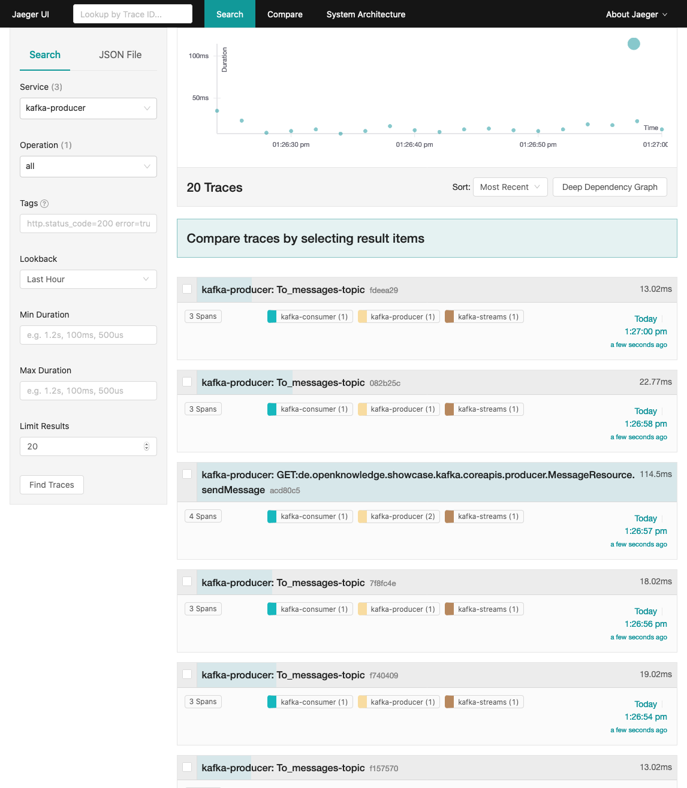

# Kafka/MQ Bridging Showcase - Kafka MQ Source

Der Showcase zeigt, wie ein MQ Broker mit Hilfe eines Kafka Konnektors 
[kafka-connect-mq-source](https://github.com/ibm-messaging/kafka-connect-mq-source) als Datenquelle mit einem Kafka Broker verbunden wird. 
Hierzu wird neben den beiden Brokern und dem Connector ein eigener MQ Queue Produzent und ein eigener Kafka Konsument bereitgestellt.

**relevante Features:**
* Apache Kafka Broker
* IBM MQ Broker
* Kafka Konnektor `kafka-connect-mq-source` 
* Integration von MP Reactive Messaging 
* Integration von JMS Message Driven Bean 
* Integration von MP OpenTracing

## Showcase ausführen

#### Schritt 1: Docker Images erstellen 

Benötigte Software:
* `maven`
* `openjdk-8` (oder andere JDK 8)
* `docker`

Führt man die Phase `package` des Maven Lifecycle aus, wird neben dem _war_-Archiv, durch das `liberty-maven-plugin` auch ein ausführbare 
JAR Dateien erstellt, welches sowohl die Anwendung als auch den Applition Server enthalten. Direkt im Anschluss wird jede JAR Datei mit 
Hilfe von Spotify's `dockerfile-maven-plugin` in ein eigenes Docker Image kopiert und bereitgestellt.

Dazu muss man folgenden Befehl ausführen:

```shell script
$ mvn clean package
```

#### Schritt 2: Docker Container starten

Nachdem die Docker Images erstellt wurden, können die Container gestartet werden. Die `docker-compose.yml` enthält alle erforderlichen 
Container um den Showcase zu starten.

* Apache Zookeeper von Confluent Inc.
* Apache Kafka Broker von Confluent Inc.
* die Java EE Anwendung `kafka-consumer`, welcher aus einen Kafka Topic liest
* Kafka Konnektor `kafka-connect-mq-source`, welcher IBM MQ als Quelle für Apache Kafka bereitstellt 
* IBM MQ Broker von IBM
* die JEE Anwendung `mq-queue-producer`, welcher Nachrichten an eine JMS Queue schreibt

Um die Container zu starten, muss man folgenden Befehl ausführen:

```shell script
$ docker-compose up
```

#### Schritt 3: Kafka Connector konfigurieren

Sobald die Broker und der Kafka Konnektor gestartet sind, kann man die Verbindung zwischen dem MQ Broker (source) und dem Kafka Broker 
(sink) herstellen.

Dazu muss der folgende HTTP Request an den Kafka Konnektor geschickt werden:

```shell script
$ curl -s -X POST -H "Content-Type: application/json" --data @kafka-connect-mq-source-config.json http://localhost:8083/connector
```

[kafka-connect-mq-source-config.json](kafka-connect-mq-source-config.json)
```json
{
  "name": "IbmMqSourceConnector",
  "config": {
    "connector.class": "com.ibm.eventstreams.connect.mqsource.MQSourceConnector",
    "tasks.max": "1",
    "topic": "DEV.FROM.MQ",
    "mq.channel.name": "DEV.ADMIN.SVRCONN",
    "mq.connection.name.list": "mq-broker(1414)",
    "mq.queue.manager": "QM1",
    "mq.transport.type": "client",
    "mq.queue": "DEV.TO.KAFKA.QUEUE",
    "mq.user.name": "admin",
    "mq.password": "passw0rd",
    "mq.message.body.jms": "true",
    "mq.record.builder": "com.ibm.eventstreams.connect.mqsource.builders.DefaultRecordBuilder",
    "key.converter": "org.apache.kafka.connect.storage.StringConverter",
    "value.converter": "org.apache.kafka.connect.storage.StringConverter",
    "confluent.topic.replication.factor": "1",
    "confluent.topic.bootstrap.servers": "kafka:9092"
  }
}
``` 

#### Schritt 4: Nachrichten Versenden und Empfangen

Um die Brücke zwischen MQ und Kafka zu testen, stellt die Anwendung `mq-queue-producer` eine REST Schnittstelle bereit, mit deren Hilfe 
eigene Nachrichten erzeugt und versendet werden können. 

Um eine eigene Nachricht zu versenden muss man den folgenden GET-Request senden:

```shell script
$ curl -X GET http://localhost:9080/mq-queue-producer/api/messages?msg=<custom message>
```

#### Schritt 5: Nachrichten mit OpenTracing und Jaeger verfolgen

[OpenTracing](http://opentracing.io/) ist ein neuer, offener Standard zur Ablaufverfolgung für verteilte Anwendungen. Entwickler mit 
Erfahrung im Aufbau von großen Mikroservice Umgebungen, Wissen um die Notwendigkeit und Bedeutung des verteilten Tracings: Logging auf 
Prozessebene und Monitoring von Metriken (Geschäftskennzahlen) sind in verteilten Systemen unverzichtbar, jedoch kann mit keinem der beiden
Ansätze die Spuren in Form Aufrufen und Nachrichten rekonstruieren, die eine einzelne Transaktion in einem verteilten System hinterlässt.

Die [MicroProfile OpenTracing](https://microprofile.io/project/eclipse/microprofile-opentracing) Spezifikation definiert das Verhalten und 
eine API für den Zugriff auf ein OpenTracing-konformes Tracer-Objekt innerhalb einer Anwendung. Die Spezifikation legt fest, in welcher 
Weise OpenTracing Spans für eingehende und ausgehende Anfragen automatisch erstellt werden. Die API definiert darüber hinaus, wie die 
Ablaufverfolgung für bestimmte Endpunkte explizit deaktiviert oder aktiviert werden kann.

[Jaeger](https://www.jaegertracing.io) ist ein verteiltes Tracing-System, das von Uber Technologies entwickelt und als Open Source Projekt 
veröffentlicht wurde. Jaeger wird die für Überwachung und Fehlerbehebung in verteilten Systemen (insbesondere Mikroservice-Architekturen) 
einschließlich verteilter Kontextpropagierung und Transaktionsüberwachung, Fehleranalyse, Abhängigkeitsanalyse sowie Performanz-und 
Latenzoptimierung genutzt.

Der Jaeger-Server stellt eine eigene UI zur Verfügung, die unter http://localhost:16681/ erreichbar ist. 

Wie beschrieben erlaubt verteiltes Tracing, die Beziehungen zwischen den Diensten in einem verteilten System nachzuvollziehen. Das Senden 
einer Nachricht durch Aufruf der REST-API des `mq-queue-consumer` (Schritt 4), die vom `kafka-consumer` konsumiert wird, führt zur 
Generierung mehrere Traces aus den der Jaeger Server einen Abhängigkeitsgraphen erzeugt. Der erzeugte Graph weist eine Verbindung zwischen 
diesen beiden Anwendungen aus. 



Weitere Einzelheiten zu Opentracing für Java und Kafka finden Sie hier:
* [jaeger-Kunde](https://github.com/jaegertracing/jaeger-client-java)
* [java-kafka-client](https://github.com/opentracing-contrib/java-kafka-client)


### Fehlerbehebung

Hin und wieder kommt es vor, dass die Docker Container beim Versuch vorzeitig zu beenden, nicht wie erwartet gestoppt werden. Dies kann dazu
führen, dass einzelne Container immer noch laufen, obwohl sie bereits gestoppt und entfernt hätten sein sollen. Um zu erkennen welche 
Docker Container noch laufen, muss man den folgenden Befehl ausführen:

```shell script
$ docker ps -a | grep <id of the container>
```

Wenn Container übrig bleiben, obwohl die Anwendung bereit angehalten wurde, kann man diese mit dem folgenden Befehl entfernen:

```shell script
$ docker rm <ids vom container>
```
